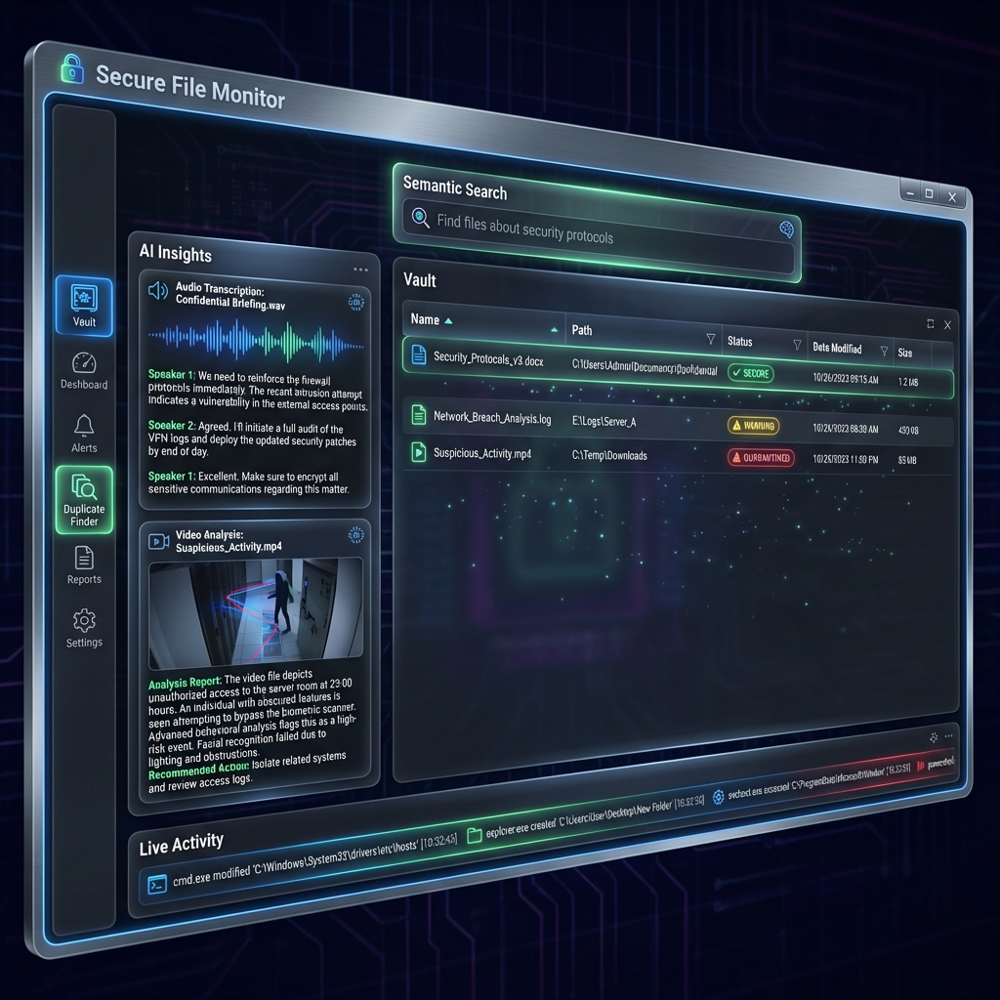

# 🛡️ SecureFileMonitor
### The Ultimate Local-First Forensic Integrity System



**SecureFileMonitor** is a next-generation file system observability platform designed for security-conscious users, malware analysts, and privacy advocates. Unlike standard file watchers, it combines **Kernel-level Event Tracing**, **Forensic Integrity Verification**, and **Local AI Analysis** into a single, cohesive dashboard.

> **Privacy Guarantee**: All AI processing (OCR, Transcription, Vector Embeddings) is performed 100% locally on your device. No data is ever sent to the cloud.

---

## 🚀 Key Capabilities

### 1. 🕵️ Forensic Integrity Monitoring (New!)
Track the "Deep State" of your file system. SecureFileMonitor detects changes that happen even when the application is closed.
*   **Smart "Deep" Scanning**: Automatically detects **New**, **Deleted**, and **Modified** files across the entire drive during startup.
*   **Merkle Tree Granular Diffing**: Don't just know *that* a file changed; know *where* it changed. The system maintains a Merkle Tree for every file, allowing you to see exactly which 4MB blocks were tampered with.
*   **Persistent Offline History**: A dedicated, encrypted audit log tracks every offline change, ensuring you never miss a beat—even after a system reboot.

### 2. 🧠 Local AI Intelligence
Turn your file system into a searchable knowledge base without sacrificing privacy.
*   **Semantic Search**: Find files by *meaning*, not just name. (e.g., search "invoice from last week" to find `inv_2023.pdf`).
*   **Whisper AI Transcription**: Automatically transcribes audio and video files using OpenAI's Whisper model (running locally via GPU/CPU).
*   **Visual Description (VLM)**: automatically generates textual descriptions for images and video frames, making visual content searchable.

### 3. ⚡ Real-Time Kernel Monitoring
*   **ETW Powered**: Hooks directly into Event Tracing for Windows to capture file events as they happen in the kernel.
*   **Process Attribution**: See exactly *which process* (PID/Name) touched your files. Was it `Explorer.exe` or `TotallyNotMalware.exe`?
*   **Smart Filtering**: Advanced noise reduction filters out benign system activity so you can focus on user-impacting events.

### 4. 🔒 Enterprise-Grade Security
*   **Encrypted Storage**: All metadata, forensic logs, and vector embeddings are stored in a SQLCipher-encrypted SQLite database.
*   **SHA256 Standardization**: All file integrity checks use industry-standard SHA256 hashing.

---

## 📦 Installation

### Prerequisites
*   **OS**: Windows 10 or Windows 11 (x64)
*   **Runtime**: .NET 10.0 SDK/Runtime
*   **Permissions**: Administrator privileges are required for ETW (Kernel Monitoring).
*   **Hardware**: NVIDIA GPU recommended (but not required) for accelerated AI tasks.

### Setup
1.  **Download**: Grab the latest release from the [Releases Page](../../releases).
2.  **Unzip**: Extract to a permanent location (e.g., `C:\Tools\SecureFileMonitor`).
3.  **Run**: Execute `SecureFileMonitor.UI.exe` **as Administrator**.
4.  **Initialize**: On first run, the system will:
    *   Initialize the encrypted database.
    *   Download necessary local AI models (Whisper, BERT, etc.).

---

## 🛠️ Usage Guide

### The "Files Changes" Tab
This is your forensic command center.
*   **View History**: See a chronological list of all files modified while the monitor was offline.
*   **Inspect Changes**: Right-click any "Modified" event and select **"🔍 Show Analysis Details"** to view the Block-Level Merkle Diff.

### The "Live Activity" Tab
Watch your system breathe in real-time.
*   **Filter**: Use the search bar to filter by Process Name, File Extension, or Event Type.
*   **Pause/Resume**: Toggle monitoring to investigate specific time windows.

---

## 🏗️ Building from Source

```powershell
# Clone the repository
git clone https://github.com/dparksports/SecureFileMonitor.git

# Navigate to directory
cd SecureFileMonitor

# Build the solution
dotnet build SecureFileMonitor.slnx -c Release
```

---

## 🤝 Contributing
Contributions are welcome! Please submit a Pull Request or open an Issue for feature requests.

## 📄 License
This project is licensed under the **Apache 2.0 License**.
