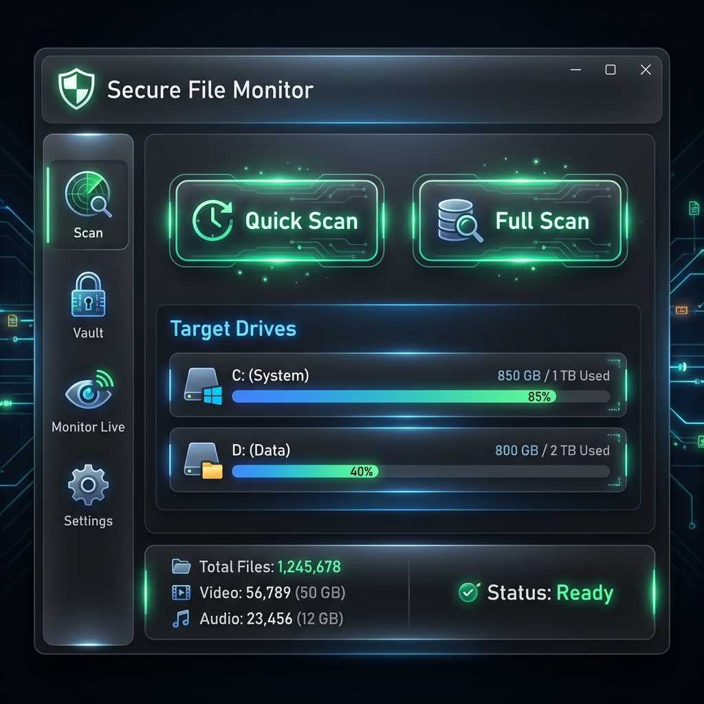

# Secure File Monitor

## Overview

**Secure File Monitor** is a professional-grade file integrity monitoring solution designed for Windows. It provides real-time tracking of file system events, cryptographic hashing for absolute integrity verification, and comprehensive audit logging to detect unauthorized modifications.

Built with a focus on performance and security, it features a modern, high-tech dark UI optimized for visibility and ease of use in security operations centers (SOC) or personal workstations.

## Key Features

*   **🛡️ Integrity Vault**: Maintains a secure database of file states (Size, Modified Date, SHA-256 Hash) to instantly detect tampering.
*   **⚡ Smart Scanning**: High-performance multi-threaded scanning engine that intelligently skips system directories (Windows, Program Files) to focus on critical user data.
*   **👁️ Live Monitoring**: Real-time tracking of file creations, modifications, deletions, and renames as they happen.
*   **🔒 Cryptographic Assurance**: Computes SHA-256 hashes for every monitored file, ensuring 100% confidence in file integrity.
*   **📝 Audit Logging**: Detailed, searchable logs of all file activities for forensic analysis and security audits.
*   **🚫 Smart Ignore Rules**: Flexible rule engine to exclude specific files, folders, or extensions from monitoring.

## Getting Started

### Installation
1.  Download the latest release from the [Releases](https://github.com/dparksports/SecureFileMonitor/releases) page.
2.  Extract the archive to a secure location.
3.  Run `SecureFileMonitor.UI.exe` as Administrator (recommended for full system access).

### Usage
1.  **Select Drives**: Choose target drives from the dashboard.
2.  **Initial Scan**: Run a "Full Scan" to establish your integrity baseline.
3.  **Monitor**: Switch to the "Monitor Live" tab to watch for real-time file system events.
4.  **Review**: Check the "Vault" for a comprehensive view of your secured files and their health status.

## System Requirements
*   **OS**: Windows 10/11 (64-bit)
*   **Runtime**: .NET 10.0 (included in self-contained release)

## License
Apache License 2.0

---
_made with ❤️ in california_
