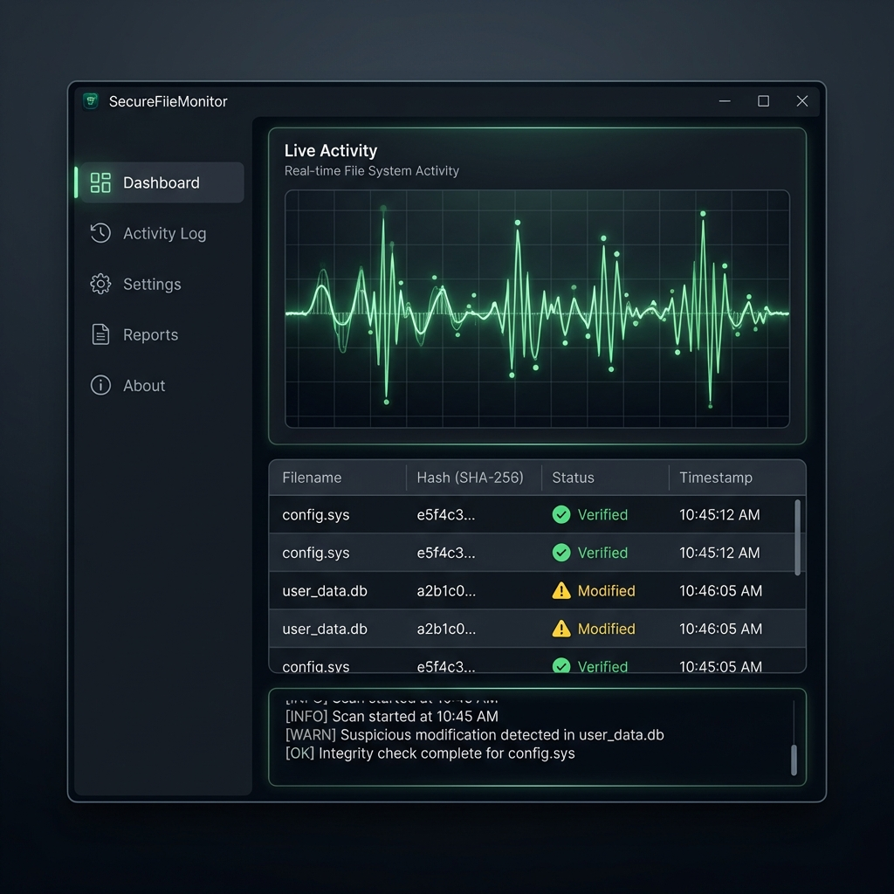

# SecureFileMonitor



**SecureFileMonitor** is a robust, real-time file integrity monitoring solution built for modern Windows environments. It enables seamless tracking of file system events with cryptographic precision, leveraging accelerated hashing and local AI integration for forensic analysis.

## 🚀 Features

### 🛡️ Integrity & Security
- **Real-Time Tracking**: Instant detection of file changes, creations, and deletions.
- **Cryptographic Hashing**: Multi-threaded SHA256 computation ensures data verification.
- **Merkle Tree Architecture**: Maintains a verified state of directory structures for forensic auditing.

### ⚡ Performance & AI
- **Hardware Acceleration**: Optional GPU offloading for high-throughput hashing operations.
- **Local AI Processing**: Integrated `Whisper.net` for offline, privacy-first audio transcription and analysis.
- **Smart Resource Management**: Dynamic thread scaling and pause/resume capabilities.

### 💾 Persistence
- **SQLite Backend**: Robust local database storage for persistence across sessions.
- **Crash Recovery**: Automatic state restoration ensures no monitoring gaps.

## 📦 Installation

1. Download the latest release from the [GitHub Releases](../../releases) page.
2. Extract the archive to a local directory.
3. Run `SecureFileMonitor.UI.exe`.

## 🛠️ Build

**Requirements:**
- Windows 10/11 (x64)
- .NET 10.0 SDK

```powershell
# Clone the repository
git clone https://github.com/dparksports/SecureFileMonitor.git

# Build the solution
dotnet build -c Release
```

---
Made with ❤️ in California.
